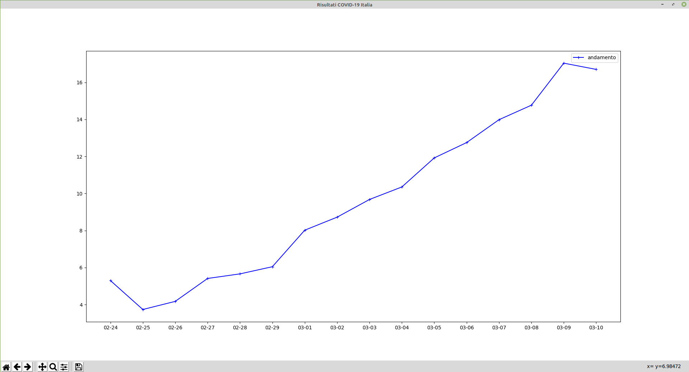

# contagi-covid19-it
Grafico dell'andamento dei contagi di COVID-19 in Italia.
Lo script fa uso dei dati ufficiali rilasciati dalla Protezione Civile (https://github.com/pcm-dpc/COVID-19).
I risultati sono calcolati come l'operazione dei casi totali diviso i tamponi effettuati.

# Requisiti
- *matplotlib*
- *urllib*

# Installazione
- Clonare la repository o scaricare la repository in .zip
- Eseguire `python3 run.py`
